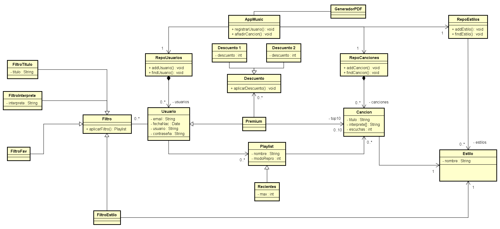

# Proyecto de TDS

## Estructura global del proyecto

El proyecto será desarrollado usando un Diseño Orientado al Dominio de la siguiente forma:

```none
|- appMusic
|   |- interfaz gráfica (Java Swing)
|   |- lógica de negocio
|   |- persistencia (H2 probablemente)

```

## Estructura de la lógica de negocio y persistencia

